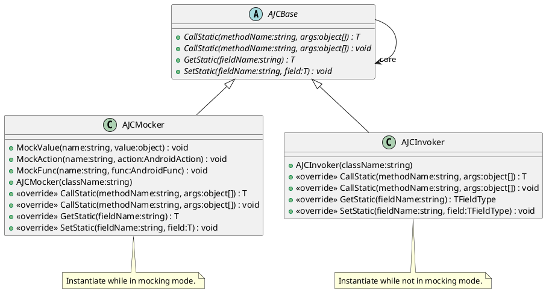
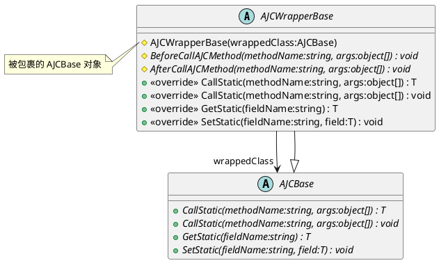

# AJCBase

[AJCBase](xref:YVR.AndroidDevice.Core.AJCBase) 作为 AJC 的抽象类封装。实例化该对象时，必须要提供需要封装的 AJC 的类名。其包含有两个实现：

-   [AJCMocker](xref:YVR.AndroidDevice.Core.AJCMocker)：为特定的 AJC 函数注册模拟数据行为/数据，让调用者期望触发 AJC 函数时，实际触发之前已经注册的模拟行为/数据。具体可见 [Mock](./AJCMocker.md)。
-   [AJCInvoker](xref:YVR.AndroidDevice.Core.AJCInvoker) ：对于 AJC 的真实封装，当调用者触发 AJC 函数时，实际调用的是正式的 Android Java Object 中的函数。

当通过 [AJCFactory.GetClass](<xref:YVR.AndroidDevice.Core.AJCFactory.GetClass(System.String)>) 时获取当前 AJC 对象时。[AJCFactory](./AJCFactory.md) 会根据当前是否处于 Mock 模式，决定返回 [AJCMocker](xref:YVR.AndroidDevice.Core.AJCMocker) 还是 [AJCInvoker](xref:YVR.AndroidDevice.Core.AJCInvoker)。具体见 [AJCFactory](./AJCFactory.md)

在实际创建的 [AJCMocker](xref:YVR.AndroidDevice.Core.AJCMocker) 和 [AJCInvoker](xref:YVR.AndroidDevice.Core.AJCInvoker) 外，还可能会包装一层 [AJCWrapper](./AJCWrapper.md)。[AJCWrapperBase](xref:YVR.AndroidDevice.Core.AJCWrapperBase) 与它的一系列派生类使用装饰模式对 [AJCBase](xref:YVR.AndroidDevice.Core.AJCBase) 进行封装，以实现对 AJC 的功能扩展，具体可见 [Wrapper](./AJCWrapper.md)。

