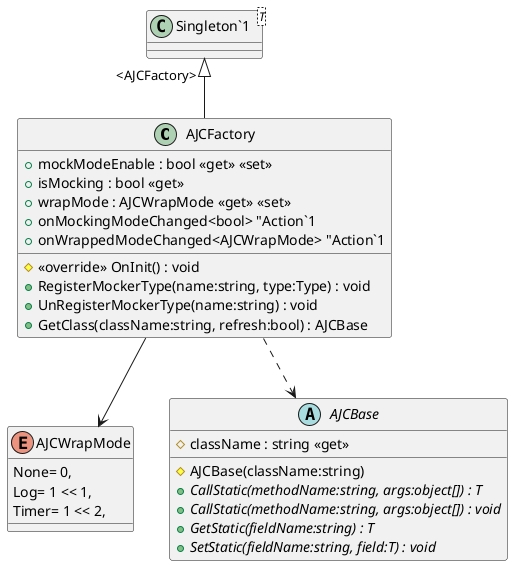

# AJCFactory

[AJCFactory](xref:YVR.AndroidDevice.Core.AJCFactory) 用于生成 [AJCBase](xref:YVR.AndroidDevice.Core.AJCBase) 对象。

-   [GetClass](#getclass) 函数根据当前的 Mocking 和 Wrap 状态决定具体生成的 [AJCBase](xref:YVR.AndroidDevice.Core.AJCBase) 对象。
-   [Callbacks](#callbacks) 用于在 Mocking 和 Wrap 状态发生变化时通知外部。通常 [AJCMgr](./AJCMgr.md) 会监听这些回调，以便在状态发生变化时重新生成 [AJCBase](xref:YVR.AndroidDevice.Core.AJCBase) 对象。

## GetClass

[GetClass](<xref:YVR.AndroidDevice.Core.AJCFactory.GetClass(System.String)>) 为 [AJCFactory](xref:YVR.AndroidDevice.Core.AJCFactory) 的核心函数，用于获取 [AJCBase](xref:YVR.AndroidDevice.Core.AJCBase) 对象。

该函数获取对象时一共会考虑以下几个因素状态来决定实例化的对象类型。

-   当前是否处于 [Mock 模式](./AJCMocker.md#mock-模式)
-   当前的 [Wrap 模式](./AJCWrapper.md#wrapmode)

### Name2MockerTypeMap

如在 [Mocker](./AJCMocker.md) 中所述，不同的的[模块](./AJCMgr.md)需要定义各自的 Mocker 类型，以便在 Mock 模式下使用。因此各个[模块](./AJCMgr.md) 应当负责调用 [RegisterMockerType](<xref:YVR.AndroidDevice.Core.AJCFactory.RegisterMockerType(System.String,System.Type)>) 来注册自己的 Mocker 类型。

在`AJCFactory` 内部维护了一个 `Name2MockerTypeMap` 字典，当 [RegisterMockerType](<xref:YVR.AndroidDevice.Core.AJCFactory.RegisterMockerType(System.String,System.Type)>) 被调用时，`Class Name` 和 `Type` 的映射关系会被存储于此。如果生成新 `AJCBase` 对象时处于 Mock 模式，则会根据 `className` 从 `Name2MockerTypeMap` 中获取对应的 `Type`，并实例化一个 `AJCBase` 对象。

> [!Warning]
> 当调用 [RegisterMockerType](<xref:YVR.AndroidDevice.Core.AJCFactory.RegisterMockerType(System.String,System.Type)>) 时必须保证传入的 `Type` 继承自 [AJCMocker](xref:YVR.AndroidDevice.Core.AJCMocker)，否则将会产生异常。

### wrapMode

当创建完新的 `AJCBase` 对象后，会根据当前的 [wrapMode](xref:YVR.AndroidDevice.Core.AJCFactory.wrapMode) 来决定是否需要对其进行包装。

包装时会根据 WrapMode 值从小达到进行包装，因此如果 WrapMode 为 `Log | Timer`，则会先对其进行 Log 包装，再对其进行 Timer 包装，具体可见 [AJCWrapper](./AJCWrapper.md)。

## Callbacks

[AJCFactory](xref:YVR.AndroidDevice.Core.AJCFactory) 会在 Mock 模式和 Wrap 模式发生变化时，触发对应的回调函数，`onMockingModeChanged` 和 `onWrappedModeChanged`。

各模块的基类 [AJCMgrSingleton](xref:YVR.AndroidDevice.Core.AJCMgrSingleton`3) 会在初始化时，注册这两个回调函数，以便在模式发生变化时，清空存储的 AJC 对象，这样在下一次调用 AJC 时根据新 Mock 和 Wrap 状态重新获取新的 AJC 对象。具体见 [AJCMgr](./AJCMgr.md)。
