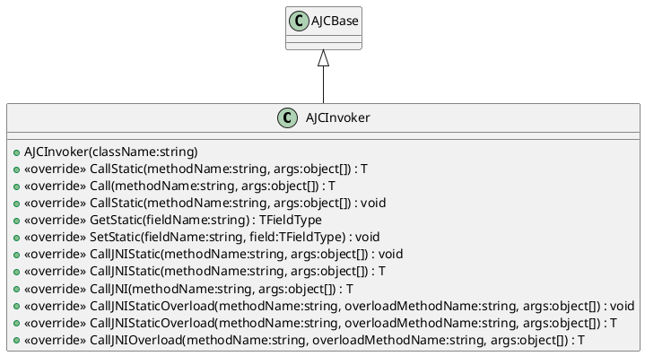

# Invoker

[AJCInvoker](xref:YVR.AndroidDevice.Core.AJCInvoker) 会实际调用 Java 侧接口：



其中的函数主要分为两类，每一类中还会具体细分 static 与否：

-   `Call`：直接调用 `AndroidJavaObject` 的接口，最为安全但存在额外找寻函数指针的开销
-   `CallJNI`：会根据传入的函数名，找寻已经生成过的函数指针，速度相对较快，但对于异常情况并无保护。如调用函数的线程未进行 AttachThread 操作，则可能导致 Crash。

> [!Caution]
> 在后续的迭代中，`Call` 系列函数会逐步被删除。因此在使用 AJC 时，应当尽可能的使用 `CallJNI` 系列的接口

## How It Works

在调用 `CallJNI` 系列函数时，会根据传入的函数名，参数名称，是否静态与否等信息，通过类似于 [GetMethodID](https://docs.unity3d.com/ScriptReference/AndroidJNIHelper.GetMethodID.html) 的方式获取到需要调用的函数指针，并将传入的函数名与函数指针存储在一个字典中。当下次调用同名函数时，会直接从字典中获取函数指针，而不需要再次进行查找。

### 对重载的处理

考虑到后续获取函数指针时，仅是根据函数名进行查找，`CallJNI` 中还提供了 `CallJNIOverload` 相关类型函数，该类型函数需要额外传递一个 `overloadMethodName` 参数，用于指定重载函数的名称。

如 Java 中封装了以下两个函数：

```java
public static void func(int i) {}
public static void func(String s) {}
```

考虑到这两个 Java 函数的命名是相同的，但是其函数指针是不同的，因此在 C# 中调用时，需要为其指定重载名，如下：

```csharp
ajcBase.CallJNIStaticOverload("func", "func_int", 1);
ajcBase.CallJNIStaticOverload("func", "func_string", "1");
```

其中 `func_int` 与 `func_string` 为自定义的重载的函数名，在调用 [GetMethodID](https://docs.unity3d.com/ScriptReference/AndroidJNIHelper.GetMethodID.html) 获取函数指针时，该重载的函数名并不会被使用，仍然是通过真正的函数名 `func` 进行找寻。但当将函数指针存储到字典中时，所用的 Key 值是传入的重载函数名，以保证两个函数指针在存储时不会被覆盖。
