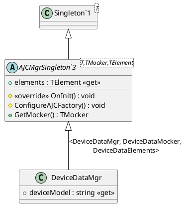

# AJCMgr

AJCMgr 作为对 [AJCBase](./AJCBase.md) 的封装，封装对 AJC 对象的操作，并提供更加具体的接口，以便调用者直接使用。每一个 `AJCMgr` 称作为`模块`。

如 [DeviceDataMgr](xref:YVR.AndroidDevice.DeviceData.DeviceDataMgr) 为一个 `AJCMgr`，当需要获取设备的 SN 号，应当调用 [DeviceDataMgr.serialNumber](xref:YVR.AndroidDevice.DeviceData.DeviceDataMgr.serialNumber) 方法，而不是调用 [AJCBase](./AJCBase.md) 的 `CallStatic("getDeviceSn")` 方法。

## AJCMgrSingleton

所有模块都继承自 `AJCMgrSingleton` 以实现 `AJCMgr`，在继承时，需要指明本模块 [AJCMocker](./AJCMocker.md) 和 [AJCElements](./AJCElements.md)(以 `TMocker` 和 `TElement` 表示)类型。

以 [设备数据模块](../../../com.yvr.android-device.common/Documentation~/DeviceData.md) 作为一个典型的 AJCMgr 例子，其定义如下：

```csharp
public class DeviceDataMgr : AJCMgrSingleton<DeviceDataMgr, DeviceDataMocker, DeviceDataElements>
{
    /// <summary>
    /// The model of device(D1,D2).
    /// </summary>
    public string deviceModel => ajcBase.CallStatic<string>(elements.getDeviceModel);
}
```

其类继承关系如下：



## OnInit

由于 [AJCMgrSingleton](xref:YVR.AndroidDevice.Core.AJCMgrSingleton`3) 继承自 `Singleton<T>`，因此在第一次访问该对象时，会调用 `OnInit` 方法进行初始化。在 `AJCMgrSingleton` 的 `OnInit` 函数中，主要执行了以下操作：

-   监听 [AJCFactory](./AJCFactory.md) 的 [AJCFactory.onWrappedModeChanged](xref:YVR.AndroidDevice.Core.AJCFactory.onWrappedModeChanged) 事件和 [AJCFactory.onMockingModeChanged](xref:YVR.AndroidDevice.Core.AJCFactory.onMockingModeChanged) 事件，以便在模拟模式或者包装模式发生变化时，清空 [AJCBase](./AJCBase.md) 对象，保证下次访问时重新创建。
-   如果在 Mocking 模式下，将 `TMocker` 类型注册给 [AJCFactory](./AJCFactory.md)。

## Get Elements

可通过 [AJCMgrSingleton.elements](xref:YVR.AndroidDevice.Core.AJCMgrSingleton`3.elements) 获取该 Module 的 [AJCElements](./AJCElements.md) 对象。如果获取时，该对象并不存在，则会根据 `TElement` 进行创建。

一个调用示例如下：

```csharp
EventTrackingElements elements = EventTrackingMgr.elements;
```

## GetMocker

可通过 [AJCMgr.GetMocker] 获取该 Module 的 [AJCMocker](./AJCMocker.md) 对象。Mocker 对象会根据此模块的 [AJCBase](./AJCBase.md) 进行获取，如果此时 [AJCBase](./AJCBase.md) 对象并非是 [AJCMocker](./AJCMocker.md) 的派生类，则返回空。

调用者可通过该接口获取此模块的 [AJCMocker](./AJCMocker.md) 并重新设置 Mock 的数值和行为，如下：

```csharp
DeviceDataMgr.instance.GetMocker().MockValue(m_Elements.getSystemVersion, "2.0.3");
string model = DeviceDataMgr.instance.systemVersion;
Assert.That(model == "2.0.3");
```
