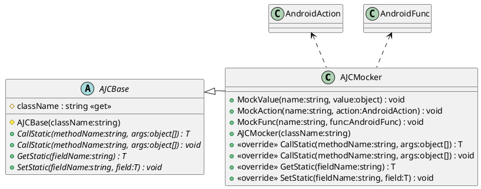

# Mock

在 Editor 中不包含有 AJC 数据，因此为了保证 AJC 对象在 Editor 中也能够正常运行，需要对 AJC 进行 Mock。

[AJCMocker](xref:YVR.AndroidDevice.Core.AJCMocker) 与 [AJCInvoker](xref:YVR.AndroidDevice.Core.AJCInvoker) 都是 [AJCBase](xref:YVR.AndroidDevice.Core.AJCBase) 的派生类，它们的区别在于前者是 Mock 的实现，后者是真正的调用实现。



[AJCMocker](xref:YVR.AndroidDevice.Core.AJCMocker) 主要提供了三种 Mock 方法，其中第一个参数都是静态方法或字段的名称，后续参数分别是模拟的数据或者行为：

-   [MockValue](<xref:YVR.AndroidDevice.Core.AJCMocker.MockValue(System.String,System.Object)>)：用于 Mock 直接返回字段的值。
-   [MockAction](<xref:YVR.AndroidDevice.Core.AJCMocker.MockAction(System.String,System.Action{System.Object[]})>)：用于 Mock 无返回值的方法的行为。
-   [MockFunc](<xref:YVR.AndroidDevice.Core.AJCMocker.MockFunc(System.String,System.Func{System.Object[],System.Object})>)：用于 Mock 方法的行为返回值。

对于每一个模块（由 [AJCMgr](./AJCMgr.md) 控制），需要定义自身的 Mocker 类，其中包含有对需要模拟的行为的定义。

如下例子中，通过 [MockAction](<xref:YVR.AndroidDevice.Core.AJCMocker.MockAction(System.String,System.Action{System.Object[]})>) 对 `elements.SendMessage` 这个行为进行了模拟。当在 Mock 状态下调用者调用 `elements.SendMessage` 时，实际上会触发该类中的 `SendMessage` 函数。

```csharp
public class UnityPlayerMocker : AJCMocker
{
    [UnityEngine.Scripting.Preserve]
    public UnityPlayerMocker(string className) : base(className)
    {
        MockAction(UnityPlayerMgr.elements.sendMessage, SendMessage);
    }

    private void SendMessage(params object[] args)
    {
        string go = args[0] as string;
        string function = args[1] as string;
        string msg = args[2] as string;
        Debug.Log($"Received message is for function {function} on go {go}, msg is {msg}");
    }
}
```

该效果的实现是通过在 [AJCMocker](xref:YVR.AndroidDevice.Core.AJCMocker) 定义了一个字典，当进行类似于 `MockAction(UnityPlayerMgr.elements.sendMessage, SendMessage)` 的操作是，实际上是将填充了一个 `Dictionary<string, AndroidAction>` 的字典，当调用者调用 `elements.SendMessage` 时，会从字典中找到对应的 `AndroidAction` 并执行。

对于

```plantuml
class UnityPlayerMocker {
    + UnityPlayerMocker(className:string)
}
AJCMocker <|-- UnityPlayerMocker
AJCBase <|-- AJCMocker
```

## Mock 模式

Mock 模式可由 [AJCFactory.isMocking](xref:YVR.AndroidDevice.Core.AJCFactory.isMocking) 查询获取。该参数是一个只读属性，主要由脚本运行的平台和 [AJCFactory.mockModeEnable](xref:YVR.AndroidDevice.Core.AJCFactory.mockModeEnable) 控制：

-   运行平台：在 Editor 中运行时，始终处于 Mock 模式
-   [AJCFactory.mockModeEnable](xref:YVR.AndroidDevice.Core.AJCFactory.mockModeEnable)：在真机平台下，默认不处于 Mock 模式。可通过将 [AJCFactory.mockModeEnable](xref:YVR.AndroidDevice.Core.AJCFactory.mockModeEnable) 设为 True，开启 Mock 模式。

> [!Note]
> 仅当 [AJCFactory.isMocking](xref:YVR.AndroidDevice.Core.AJCFactory.isMocking) 为 True 时，才会使用 [AJCMocker](xref:YVR.AndroidDevice.Core.AJCMocker) 进行 Mock。
