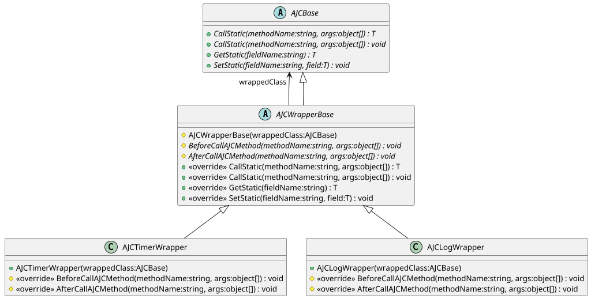
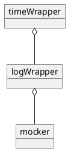

# Wrapper

[AJCWrapperBase](xref:YVR.AndroidDevice.Core.AJCWrapperBase) 及其一系列派生类以装饰器模式对 [AJCBase](xref:YVR.AndroidDevice.Core.AJCBase) 进行封装，以实现在调用 AJC 函数**前**和调用 AJC 函数**后**进行一些额外的操作。

目前提供了 `AJCLogWrapper` 和 `AJCTimerWrapper` 两种 Wrapper，其类关系图为：

-   `AJCLogWrapper` 为一个日志装饰器，将在调用函数前后，分别输出调用 AJC 函数的方法名、参数等信息，形式为 `Before/After Calling AJC Method: {methodName}, with args: {args.ToElementsString()}`。
-   `AJCTimerWrapper` 为一个计时装饰器，会记录函数调用前后的时间差。

## WrapMode

当通过 [AJCFactory.GetClass](<xref:YVR.AndroidDevice.Core.AJCFactory.GetClass(System.String)>) 获取对象时会根据 [WrapMode](xref:YVR.AndroidDevice.Core.AJCFactory.wrapMode) 的值来决定使用何种装饰器。

> [!Note]
> 当将 wrapMode 设为 None 时，生成的 AJC 对象不包含任何 Wrapper

[AJCWrapMode](xref:YVR.AndroidDevice.Core.AJCWrapMode) 枚举类型以 Flags 特性修饰，因此可以通过按位或运算符将多个枚举值组合成一个值。如将值定义为 `AJCWrapMode.Log | AJCWrapMode.Timer`，则在调用 AJC 函数前后，会分别输出调用 AJC 函数的方法名、参数等信息，以及记录函数调用前后的时间差。

## WrappedClass

在每一个 Wrapper 中都有一个 `WrappedClass` 字段，用于保存被装饰的对象，被装饰的对象本身是 [AJCMocker](xref:YVR.AndroidDevice.Core.AJCMocker) 或 [AJCInvoker](xref:YVR.AndroidDevice.Core.AJCInvoker) 也可能是另一个 Wrapper。

如将 [WrapMode](xref:YVR.AndroidDevice.Core.AJCFactory.wrapMode) 设为 `AJCWrapMode.Log | AJCWrapMode.Timer`，且当前 Mocking 模式为 True，则在调用 [AJCFactory.GetClass](<xref:YVR.AndroidDevice.Core.AJCFactory.GetClass(System.String)>) 时，会先生成一个 [AJCMocker](xref:YVR.AndroidDevice.Core.AJCMocker)，再将其作为新生成的 `AJCLogWrapper` 对象的 `WrappedClass`，最后将生成的 `AJCLogWrapper` 对象作为新生成的 `AJCTimerWrapper` 对象的 `WrappedClass` 。
即，最终生成的对象为 `AJCTimerWrapper`，其 `WrappedClass` 为 `AJCLogWrapper`，其 `WrappedClass` 为 `AJCMocker`，对象关系为：

