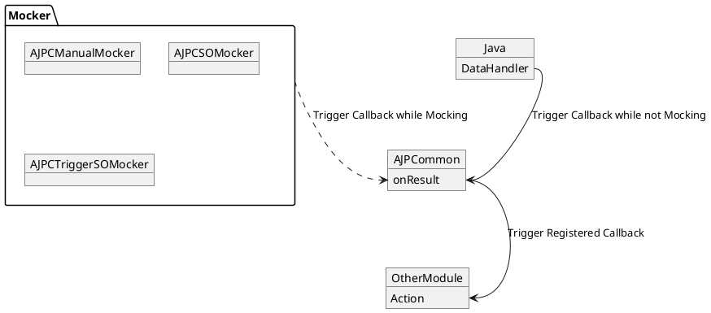

# Android Java Proxy Common

Android Java Proxy Common 是对 Android 侧回调的封装，以提供统一的回调处理方式。

> [!Note]
>
> Android Java Proxy Common 下将简称为 `AJPC`

AJPC 主要有以下构成：

-   [AJPCommon](AJPC/AJPCommon.md): AJPC 的核心类，用以提供对 Android 侧回调的封装

整体示意图如下所示，即 [AJPCommon](AJPC/AJPCommon.md) 在收到回调时，会触发其他模块的监听者。而 `AJPCommon` 的回调出发者根据当前的 Mocking 状态可以来自于 Android 侧的代码，也可以来自于 Mocker：

> [!Note]
>
> 关于各 Mocker 触发 [AJPCommon](AJPC/AJPCommon.md) 中回调的流程，请参考各 Mocker 的文档。
