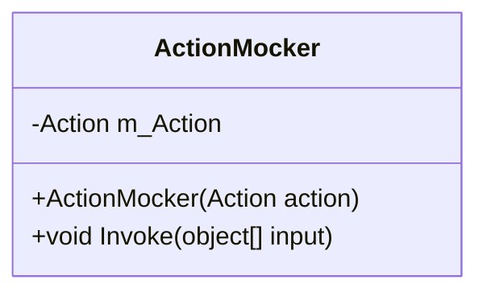
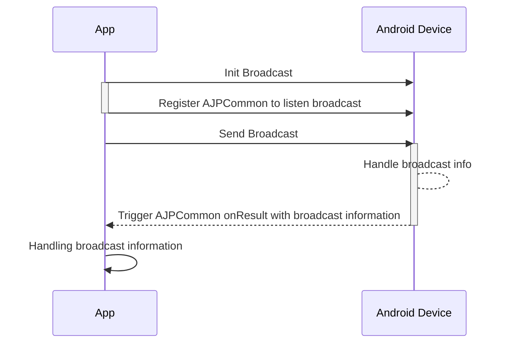

# Action Mocker

[ActionMocker](xref:YVR.AndroidDevice.Core.ActionMocker) 用于模拟 Android 接口的行为，当创建一个 `ActionMocker` 时，需要传入一个 `Action` 作为模拟的行为。`ActionMocker` 会在 `Invoke` 函数调用时调用传入的 `Action`。整个类示意图如下：


> [!tip]
>
> 实际上 [ActionMocker](xref:YVR.AndroidDevice.Core.ActionMocker) 就是对 `Action` 的封装，理论上调用者不使用 `ActionMocker` ，直接调用 `Action` 也是可以的。但是为了统一 Mocking 的方式，我们将 `Action` 封装为 `ActionMocker`。

一个典型的 `ActionMocker` 的使用是在 [BroadcastMocker](xref:YVR.AndroidDevice.Broadcast.BroadcastMocker) 中模拟广播的发送事件。在设备真机上，广播的发送和接受流程如下所示：



我们可以使用 `ActionMocker` 来模拟广播的发送事件。当初始化时，我们将包含有收到广播后处理行为的 `AJPCommon` 保存至本地，并用 `ActionMocker` 模拟发送广播的行为：处理广播信息，并将处理好后的信息交给 `AJPCommon.onResult` 以触发收到广播后的行为。当上层调用了 `SendBroadcast` 时，调用 `ActionMocker.Invoke` 来触发之前定义在 `ActionMocker` 内部的模拟广播发送的行为。

```csharp
public BroadcastMocker()
{
    // ...
    MockAction(BroadcastMgr.elements.sendAndroidBroadcast, SendBroadcast);
    MockAction(BroadcastMgr.elements.initAndroidBroadcast, InitAndroidBroadcast);
    // ...
}

// 当注册广播时，将 AJPCommon 保存到本地，并设定一个 ActionMocker，其模拟的行为是 MockBroadcastRet
private void InitAndroidBroadcast(object[] args)
{
    m_AJPCommon = (AJPCommon<string>) args[0];
    m_ActionMocker = new ActionMocker(MockBroadcastRet);
}

// 当发送广播时，调用 ActionMocker 的 Invoke 函数，以模拟广播发送事件
private void SendBroadcast(object[] args) { m_ActionMocker.Invoke(args); }

// 模拟广播发送事件，处理传入的数据并直接调用 AJPCommon 的 onResult 函数，以模拟广播回调被触发。
private void MockBroadcastRet(object[] input)
{
    // ...
    string action = input[0].ToString();
    string json = GetJsonMsg();
    this.Debug($"Send broadcast to {action} with json: {json}");
    m_AJPCommon.onResult(json);
    // ...
}
```
