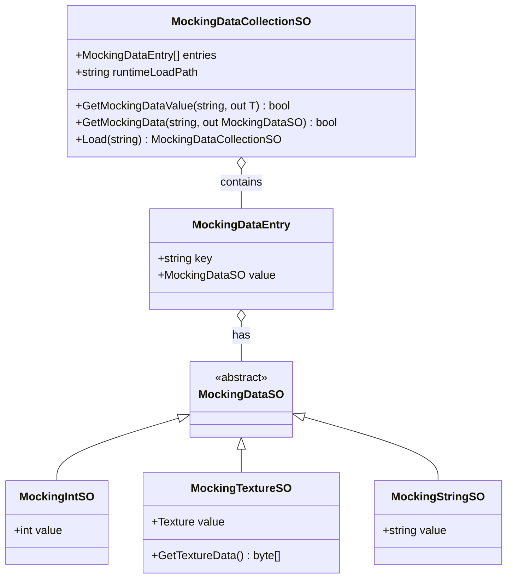
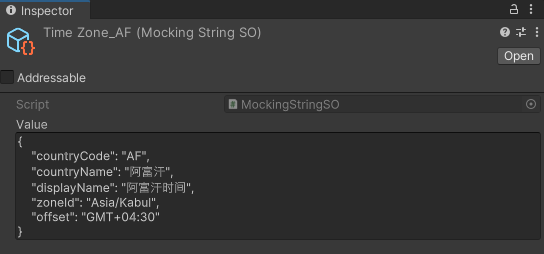
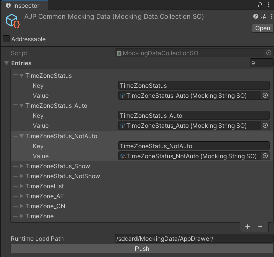

# Data Mocker

Data Mocker 系列脚本是对于模拟数据的直接封装，用于模拟 Android 接口返回的数据。Mocking Data 依赖 Unity 的 [ScriptableObject](https://docs.unity3d.com/Manual/class-ScriptableObject.html)，将一系列 Mock 事件的数据定义在 SO 的实例中。

整体的示意图为：



> [!tip]
>
> 对于在代码中获取 Mocking Data，都应当通过 [Mocking Data Collection SO](#mocking-data-collection-so) 进行获取，详情见 [运行时获取 Mocking 数据](#运行时获取-mocking-数据)。[Mocking Data SO](#mocking-data-so) 只是为了方便在 Editor 中快速修改存储的 Mocking 数据。

## Mocking Data SO

每一个 [MockingDataSO](xref:YVR.AndroidDevice.Core.MockingDataSO) 是一个抽象类，不同类型的对象需要各自派生该抽象类并实现，如针对 `string` 类型的 Mocking 数据，我们定义了 [MockingStringSO](xref:YVR.AndroidDevice.Core.MockingStringSO) ，其实现如下：

```csharp
[CreateAssetMenu(fileName = "StringMockingData", menuName = "YVR/Android-Device/MockingData/String")]
public class MockingStringSO : MockingDataSO
{
    [TextArea(1, 100)] public string value;
}
```

如下为一个典型的 `MockingStringSO`，它记录了关于阿富汗的时区信息：



## Mocking Data Collection SO

对于一个 [Mocking Data Collection SO](xref:YVR.AndroidDevice.Core.MockingDataCollectionSO) 用以管理一系列已经创建好的 [Mocking Data SO](#mocking-data-so) 实例，如下为一个典型的 `MockingDataCollectionSO`：



可以看到其中包含有一系列 Key 和 Value 的组合，其中 Key 为 `string` 类型，Value 为 [Mocking Data Collection SO](xref:YVR.AndroidDevice.Core.MockingDataCollectionSO) 实例。

### 运行时获取 Mocking 数据

在代码中获取 Mocking 数据时，首先应该获取到 [Mocking Data Collection SO](#mocking-data-collection-so) 实例。可以通过 [MockingDataCollectionSO.Load](<xref:YVR.AndroidDevice.Core.MockingDataCollectionSO.Load(System.String)>) 获取 [Mocking Data Collection SO](#mocking-data-collection-so) 的实例：

```csharp
private string testingFolder => Application.isEditor
    ? "Packages/com.yvr.android-device.system/Tests/Runtime/AppDrawer/MockingData"
    : "/sdcard/MockingData/AppDrawer/";

string mockingDataPath = Application.isEditor
    ? $"{testingFolder}/MockingDataCollection.asset"
    : $"{testingFolder}/collection.json";

m_MockingDataCollection = MockingDataCollectionSO.Load(mockingDataPath);
```

在上例中，之所以要区分 Editor 和 Runtime 的路径，是因为在 Editor 中，[MockingDataCollectionSO.Load](<xref:YVR.AndroidDevice.Core.MockingDataCollectionSO.Load(System.String)>) 的实现时通过 `AssetDatabase.LoadAssetAtPath` 来加载 Mocking Data Collection SO 的实例，而在 Runtime 中，实现是通过 `File.ReadAllText` 读取目标地址的 JSON 文件并通过`JsonConvert` 进行反序列化，变为 [Mocking Data Collection SO](#mocking-data-collection-so) 的实例。

在获取了 [Mocking Data Collection SO](#mocking-data-collection-so) 实例后，可以通过 [MockingDataCollectionSO.GetMockingData](<xref:YVR.AndroidDevice.Core.MockingDataCollectionSO.GetMockingData(System.String,YVR.AndroidDevice.Core.MockingDataSO@)>) 获取对应 Key 的 [MockingDataSO](xref:YVR.AndroidDevice.Core.MockingDataSO) 实例。示例如下所示：

```csharp
m_MockingDataCollection.GetMockingData(targetIconPath, out MockingDataSO mockingData);
var mockingTexture = mockingData as MockingTextureSO;
```

可以通过 [MockingDataCollectionSO.GetMockingDataValue](<xref:YVR.AndroidDevice.Core.MockingDataCollectionSO.GetMockingDataValue``1(System.String,``0@)>) 来获取 [MockingDataSO](xref:YVR.AndroidDevice.Core.MockingDataSO) 中具体包含的数据，调用如下所示：

```csharp
if (m_MockingDataCollection.GetMockingDataValue("InstalledApps", out string installedApps))
    MockValue(elements.getInstalledAppList, installedApps);
```

> [!caution]
>
> [MockingDataCollectionSO.GetMockingDataValue](<xref:YVR.AndroidDevice.Core.MockingDataCollectionSO.GetMockingDataValue``1(System.String,``0@)>) 假定 [MockingDataSO](xref:YVR.AndroidDevice.Core.MockingDataSO) 的派生类中包含有一个 `value` 字段，用以存储具体的 Mocking 数据。如果没有该字段，将会抛出异常。
