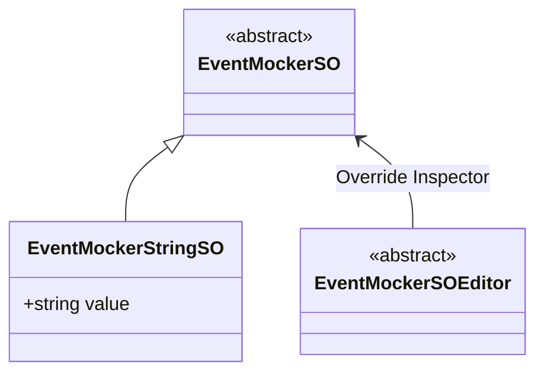
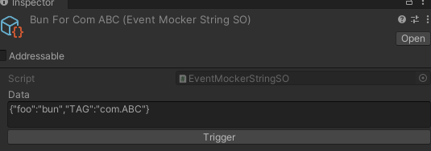

# Event Mocker

Event Mocker 用于模拟 Android 设备上的事件（如 Wifi 的连接 / 断开），该 Mocker 依赖于 Unity 的 `ScriptObject`，可以在 Editor 中通过 `ScriptObject` 实例模拟特定事件的发生。

在 Event Mocker 体系下，事件的信息存储在 [EventMockerSO](xref:YVR.AndroidDevice.Core.EventMockerSO`1) 中，它与 [MockingDataSo](xref:YVR.AndroidDevice.Core.MockingDataSO) 类似，都是基于 Unity 的 `ScriptableObject`，且都有一系列的派生类，用于存储不同类型的事件信息。

整体的示意图如下所示，其中 `EventMockerSOEditor` 用来重写 `EventMockerSO` 在 Inspector 中的显示，为其增加一个按钮，用于触发事件：



一个典型的 `EventMockerStringSO` 的实例如下：



对于一个 [EventMockerSO](xref:YVR.AndroidDevice.Core.EventMockerSO`1) 而言，它除了需要存储事件的信息外，还需要存储事件的回调。事件的回调无法像数据一样序列化存储在硬盘上，因此我们额外提供了函数 [EventMockerSO.RegisterEvent](<xref:YVR.AndroidDevice.Core.EventMockerSO`1.RegisterEvent(System.String,System.Action{`0})>) 供使用者注册回调函数。
- 该函数有两个形参，第一个形参类型为 `string`，它表示所有 `EventMockerSO` 存储的路径，第二个形参类型为 `Action<T>`，它表示事件发生时的回调函数。
- 当函数被调用时，它会所有第一个形参所表示的路径下的所有 `EventMockerSO` 实例，将第二个形参所表示的回调函数注册到所有实例中。当实例 Inspector 面板上的按钮被点击时，其注册的回调函数会被调用。

## 使用示例

```csharp
public class BroadcastFooListener : MonoBehaviour
{
    private void Start()
    {
        BroadcastMgr.instance.RegisterBroadcast<Action<string>>("com.ABC", FooValue, false, "foo");

        BroadcastMocker mocker = BroadcastMgr.instance.GetMocker();
        string thisPath = Path.GetDirectoryName(AssetDatabase.GetAssetPath(MonoScript.FromMonoBehaviour(this)));
        mocker.SetBroadcastEventMockerPath(thisPath);

        return;

        void FooValue(string fooValue) { Debug.Log($"Foo Value is {fooValue}"); }
    }
}

public class BroadcastMocker: AJCMocker
{
    // ...
    [Conditional("UNITY_EDITOR")]
    public void SetBroadcastEventMockerPath(string path)
    {
        EventMockerSO<string>.RegisterEvent(path, data =>
        {
            m_AJPCommon.onResult(data);
        });
    }

    // ...
}

```

`BroadcastFooListener` 脚本所在的目录下，存在两个 `EventMockerStringSO` _BarForComABC_ 和 _BunForComABC_，他们分别包含有如下两条数据：

```text
{"foo":"bar","TAG":"com.ABC"}
{"foo":"bun","TAG":"com.ABC"}
```

此时当点击 _BarForComABC_ 的 `Trigger` 按钮时，`BroadcastFooListener` 中的 `FooValue` 函数会被调用，传递的参数为 `bar`。当点击 _BunForComABC_ 的 `Trigger` 按钮时，`BroadcastFooListener` 中的 `FooValue` 函数会被调用，传递的参数为 `bun`。如下所示：


